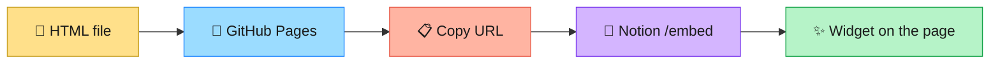

<div align="center">

# 🕯️ C+F Digital Brain
### Notion widgets · copy a URL · paste · done

[](https://frankies2727.github.io/Digital-Brain-Notion-Widgets/)
[](https://frankies2727.github.io/Digital-Brain-Notion-Widgets/flip-clock.html)
[](#-edit-a-widget)
[](#-widget-gallery)

**Base URL**

```
https://frankies2727.github.io/Digital-Brain-Notion-Widgets/
```

Each file is one embed. Open Notion → type <kbd>/embed</kbd> → paste a link → stretch the block.

</div>

---

<div align="center">

## ⚡ Start here

</div>

```text
1. Notion page
2. /embed
3. paste a URL from below
4. drag the block full-width   height ~220–320px
```

> First load after a push can be blank for a minute. Hard-refresh. GitHub Pages is slow once, then fine.



---

<div align="center">

## 🎨 Widget gallery

Pick a card. Copy the URL. That is the whole job.

</div>

<table>
<tr>
<td width="50%" valign="top">

### ⏱️ Flip clock
[](https://frankies2727.github.io/Digital-Brain-Notion-Widgets/flip-clock.html)

Split-flap **date + time + seconds**.
Always `America/Chicago`.
Label flips **CDT** ↔ **CST** by itself.

```
https://frankies2727.github.io/Digital-Brain-Notion-Widgets/flip-clock.html
```

| want this | stick this on the URL |
| :--- | :--- |
| 🕰️ 24-hour | `?format=24` |
| ☀️ light cards | `?theme=light` |
| 🪟 clear bg | `?bg=transparent` |
| ✨ both | `?theme=light&bg=transparent` |

```
.../flip-clock.html?format=24
.../flip-clock.html?theme=light&bg=transparent
```

</td>
<td width="50%" valign="top">

### 🌌 Orrery
[](https://frankies2727.github.io/Digital-Brain-Notion-Widgets/orrery.html)

Live solar system. Planets sit where they actually are. No clock readout. Quieter starfield.

```
https://frankies2727.github.io/Digital-Brain-Notion-Widgets/orrery.html
```

File: `orrery.html`

</td>
</tr>
<tr>
<td width="50%" valign="top">

### 💖 Days together
[](https://frankies2727.github.io/Digital-Brain-Notion-Widgets/index%20(6).html)

Live day count from the FIRE Conference start date.

```
https://frankies2727.github.io/Digital-Brain-Notion-Widgets/index%20(6).html
```

File: `index (6).html`  
Filename has a space — use the encoded URL above.

</td>
<td width="50%" valign="top">

### ✨ Quotes — offline
[](https://frankies2727.github.io/Digital-Brain-Notion-Widgets/motivaitonalWithNoAPI.html)

Works with no quote API. Safer default.

```
https://frankies2727.github.io/Digital-Brain-Notion-Widgets/motivaitonalWithNoAPI.html
```

File: `motivaitonalWithNoAPI.html`

</td>
</tr>
<tr>
<td width="50%" valign="top" colspan="2">

### 🌐 Quotes — with API
[](https://frankies2727.github.io/Digital-Brain-Notion-Widgets/motivaitonalWithAPI.html)

Same vibe, pulls quotes from an API. Use only if the offline one is not enough.

```
https://frankies2727.github.io/Digital-Brain-Notion-Widgets/motivaitonalWithAPI.html
```

File: `motivaitonalWithAPI.html`

</td>
</tr>
</table>

---

<div align="center">

## 🧠 Edit a widget

</div>

```text
open the .html file  →  change it  →  push main  →  wait 30–60s  →  hard-refresh Notion
```

No build. No npm. Pages serves the files as-is.

---

<div align="center">

## 📁 Files

</div>

| color | file | what it is |
| :---: | :--- | :--- |
| 🟧 | `flip-clock.html` | Chicago flip clock |
| 🟪 | `orrery.html` | solar-system orrery |
| 🗬 | `index (6).html` | days together |
| 🟩 | `motivaitonalWithNoAPI.html` | quotes, offline |
| 🟦 | `motivaitonalWithAPI.html` | quotes, API |
| ⚪ | `.nojekyll` | tells Pages “just serve the files” |

---

<div align="center">

## 🔧 If something breaks

</div>

| symptom | fix |
| :--- | :--- |
| 🛑 **404 on a new file** | wait one minute, hard-refresh |
| 📎 **embed looks tiny** | stretch the Notion block — the widget fills the iframe |
| 🕒 **wrong time zone** | flip clock ignores the browser zone. It is Chicago-only |
| ⏸️ **want 24-hour** | add `?format=24` to the flip-clock URL |

<div align="center">

<br/>

`/embed` · paste · stretch · done

</div>
